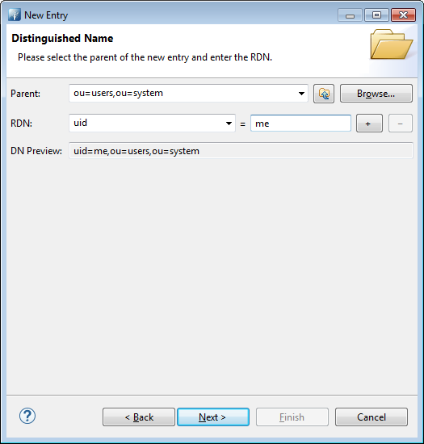
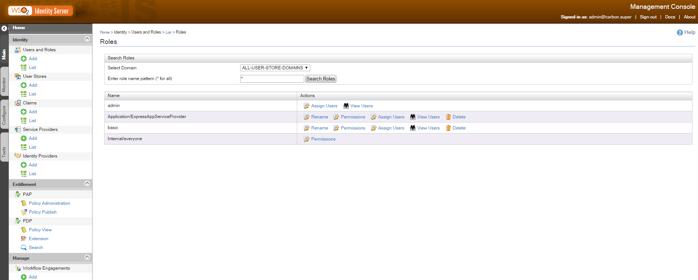

Authentication with standard protocols is often a daunting task for most people. SAML, OAuth2, etc. seem cumbersome and too difficult to integrate in an application. What's more, their roles and limits are fuzzy to a lot of developpers. Let's try to demystify this natural functionnality in any web application. In this tutorial, we'll use SAML2 with WSO2 Identity Server connected to a LDAP server as a users store. The application will be implemented with Express / Passport. 

# Prerequisites

* [Apache studio directory](http://apache.mirrors.ovh.net/ftp.apache.org/dist/directory/studio/2.0.0.v20151221-M10/ApacheDirectoryStudio-2.0.0.v20151221-M10-win32.win32.x86_64.zip)
* [Node](https://nodejs.org/dist/v4.4.3/node-v4.4.3-x64.msi)
* [WSO2](http://product-dist.wso2.com/products/identity-server/5.1.0/wso2is-5.1.0.zip)
* [C9](https://github.com/c9/core)

Click on the links to get the components of our tutorial in the right version used. Apache Directory Studio will be our LDAP server, but of course you should be able to use any other LDAP Server in your own environment. WSO2 is well documented and easy to manage, it will take the role of our Identity Server. And C9 is my little sweet IDE for any Javascript development, I recommend it but you can use any other one convenient to you. Do I need to present Node ?

# LDAP Server creation

After installation of all requirements, let's begin to configure our environment.Launch Apache Studio and then create a LDAP Server. In the "LDAP Servers" tab, click on "New Server" button.

{:class="cropped"}{:data-action="zoom"}

Then, check the ports of your newly created LDAP Server by double clicking the new server.

{:class="cropped"}{:data-action="zoom"}

Now, proceed to create a connection to your LDAP Server as shown below

{:class="cropped"}{:data-action="zoom"}

You should get a confirmation message

{:class="cropped"}{:data-action="zoom"}

Open it by double-clicking it in the "connection" tab or by contextual menu

{:class="cropped"}{:data-action="zoom"}

# Users & Groups creation

Users and roles can be created directly in WSO2, but for demonstration's sake let's create them in the LDAP. If you want to automatize users and roles creation or import, you'll need this section. First, create a user in the LDAP under ou=users,ou=system.

{:class="cropped"}{:data-action="zoom"}

Follow the assistant as described

{:class="cropped"}{:data-action="zoom"}

Give it a inetOrgPerson class, automatically a few others classes will be added

{:class="cropped"}{:data-action="zoom"}

Then choose a name as its uid. Here, very cleverly I choose "me" as the best name describing ... me.

{:class="cropped"}{:data-action="zoom"}

A sn and cn are needed to confom to the LDAP Schema. Add them in the assistant before trying to create it

{:class="cropped"}{:data-action="zoom"}

No authentication without password, add it as a new attribute by these two steps by right-click then "New Attribute"

{:class="cropped"}{:data-action="zoom"}

Then

{:class="cropped"}{:data-action="zoom"}

Choose a good and secured password. And more securely, choose a salted algo like SSHA

{:class="cropped"}{:data-action="zoom"}

Now, create a group for our user as follows. First, create a new entry under ou=groups,ou=system with "groupOfNames" class. Let's call it "basic"

{:class="cropped"}{:data-action="zoom"}

{:class="cropped"}{:data-action="zoom"}
 
Then add "me" user as a member after clicking next

{:class="cropped"}{:data-action="zoom"}

## WSO2 configuration

WSO2 runs an embedded LDAP Server we must disable and replace by our own one.To that purpose, in %WSO2_HOME/repository/conf/identity/embedded-ldap.xml, turn it off.

<EmbeddedLDAP>
  <Property name="enable">false</Property>
    ...
</EmbeddedLDAP>

 
Now, let's indicates how to connect to our LDAP Server, change the following section from %WSO2_HOME/repository/conf/user-mgt.xml according to your environment.


<UserStoreManager class="org.wso2.carbon.user.core.ldap.ReadWriteLDAPUserStoreManager">
  <Property name="ConnectionURL">ldap://localhost:${Ports.EmbeddedLDAP.LDAPServerPort}</Property>
  <Property name="ConnectionPassword">admin</Property>
  <Property name="UserSearchBase">ou=Users,dc=wso2,dc=org</Property>
  <Property name="UserEntryObjectClass">identityPerson</Property>
                                .....
  <Property name="GroupSearchBase">ou=Groups,dc=wso2,dc=org</Property>
                                .....
  <Property name="SCIMEnabled">true</Property>
                                .....
  <Property name="defaultRealmName">WSO2.ORG</Property>
                                ...
</UserStoreManager>

 
In our case, we'll change them to

<Property name="ConnectionURL">ldap://localhost:${Ports.EmbeddedLDAP.LDAPServerPort}</Property>
<Property name="ConnectionPassword">secret</Property>
<Property name="UserSearchBase">ou=users,ou=system</Property>
<Property name="UserEntryObjectClass">inetOrgPerson</Property>
    ...
<Property name="GroupSearchBase">ou=groups,ou=system</Property>
    ...
<Property name="SCIMEnabled">false</Property>
    ...
<Property name="defaultRealmName">mycompany.org</Property>

 
This section needs some explanations.

 - I didn't change the port configuration as the expression in ConnectionURL property resolves to 10389 (have a look at %WSO2_HOME/repository/conf/carbon.xml then Server/Ports/EmbeddedLDAP/LDAPServerPort element to get the value). You remember we checked the port value of our LDAP Server and it was indeed 10389. So no need to change it. Of course, in our example we'll address a local server but in your production environment you'll have to name it instead of localhost.
 - The default password of the admin user of ApacheDirectoryStudio is secret so change it in ConnectionPassword property.
 - The base of our user entries is ou=users,ou=system in our LDAP Server so be the value of UserSearchBase property.
 - Our class of users was inetOrgPerson not identityPerson.Accord UserEntryObjectClass to this value.
 - The group entries base is located elsewhere than the default configuration. Switch GroupSearchBase to ou=groups,ou=system for the same reason as the users entries.
 - Turn SCIM off, we don't need it here.
 - Of course name your realm according to your topology, here I chose mycompany.org as defaultRealmName.

## User & Role

Launch the WSO2 IS server by %WSO2_HOME/bin/wso2server.bat start. Don't forget to set JAVA_HOME before that.
Do you remember our 'me' user and its 'basic' group ? Let's find them in our WSO2 server.First, under 'Users and Roles'/List/Users in the console you'll find our user.

{:class="cropped"}{:data-action="zoom"}

And our group ? It's changed to a role in WSO2. Find it under 'Users and Roles'/List/Roles

{:class="cropped"}{:data-action="zoom"}

Of course, you can verify the user role membership by clicking on 'View Users' in the Roles panel or 'View Roles' in the Users panel.

## Service Provider & SAML2

Then, create a service provider by clicking on 'Service Providers'/Add. Name it according to your desire and register it. Here, I named it ExpressAppServiceProvider.

{:class="cropped"}{:data-action="zoom"}

An important part of our configuration is to determine what attributes will be sent in response of a successful authentication. These attributes can be very different depending on the user store. To solve part of this problem, attributes are not declared directly but referenced by general and 'standard' names. These names are presented as claims. Claims are nothing more than standardized URI names to identify an attribute. However, there is no uniq way to use claims so a collection of possibilities is offered to your choice. In our tutorial, we choose to send back the email address of our authenticated user. So in the next screen after registration of our Service Provider do it this way.

{:class="cropped"}{:data-action="zoom"}

We want to use SAML2. We'll configure it by clicking 'configure' under 'Inbound Authentication Configuration'/'SAML2 Web SSO Configuration'

{:class="cropped"}{:data-action="zoom"}

Configure our authentication as follows

{:class="cropped"}{:data-action="zoom"}

Here we identify our application with an issuer id (issuer of authentication requests of course). Then we must indicate the URL the SAML response will be returned to. Insert the URL in 'Assertion Consumer URLs' then click add and choose it in the 'Default Assertion Consumer URL'. Note these two important informations as we'll need them shortly in our application.
## Application Express / Passport

Passport is a javascript library managing different kind of protocols for authentication and authorization. We'll use it in a simple Express Application for demonstration purpose.

You'll have to install its SAML plugin as well.First create your application by installing dependencies. Here you get the package.json I used for the tutorial.

    {
      "name": "express-saml",
      "version": "1.0.0",
      "description": "",
      "main": "server.js",
      "scripts": {
        "test": "echo \"Error: no test specified\" && exit 1"
      },
      "keywords": [
        "express",
        "saml"
      ],
      "author": "ivan matmati",
      "license": "ISC",
      "dependencies": {
        "body-parser": "^1.15.1",
        "express": "^4.13.4",
        "express-session": "^1.13.0",
        "passport": "^0.3.2",
        "passport-saml": "^0.15.0"
      }
    }

 
As you can notice, a specific plugin has been added to Passport to take care of SAML messages. The plugin used is passport-saml. Then follows the code example to get authentication from WSO2 through SAML2 protocol.


var express = require("express");
var passport = require("passport");
var SamlStrategy = require('passport-saml').Strategy;
var bodyParser = require("body-parser");
var session = require("express-session");
var app = express();
app.use(bodyParser.urlencoded({
  extended: true
}));
app.use(session({ secret: 'this shit hits'}));
app.use(passport.initialize());
app.use(passport.session());
    
var redirectLogin = function (req,res,next) {
   if (!req.isAuthenticated()) {
       res.redirect("/myapp/login");
   }
   next();
}
passport.serializeUser(function(user, done) {
     done(null, user);
});
    
passport.deserializeUser(function(user, done) {
     
  done(null, user);
});
    
passport.use(new SamlStrategy({
    entryPoint: 'https://localhost:9443/samlsso',
    issuer: 'MyAppExpress'
  },
  function(profile, done) {
    var myUser = {
      email : profile.nameID
    }
    done(null, myUser);
  }));
    
app.get('/myapp/login',
  passport.authenticate('saml', {
    successRedirect: "/myapp",
    failureRedirect: "/myapp/login",
  }));
    
    
app.post('/myapp/saml', passport.authenticate('saml', {
    failureRedirect: "/myapp/login",
    failureFlash: true
  })
  ,
  function(req, res) {
    res.redirect("/myapp");
  }
);
    
    
app.get("/myapp",redirectLogin, function(req, res) {
   
    res.send("you're authenticated !!!! "+ JSON.stringify(req.user));
});
    
    
app.listen(process.env.PORT || 8080);

 
The logic is quiet simple.
First, we need to create a session in express so that authenticated users can be recognized in subsequent calls. To that end, we use express-session. After the classic initialization of Passport by a call to initialize, we inject the returned middleware into our Express application. And then we finish the session management by "inserting" the session manager of Passport by a call to its session() method. All of this is clearly explained in the github pages of Passport.

Just before these initialization lines, you certainly noticed the use of an other middleware, bodyParser. Why ? it'll become clear afterwards when we'll reach the SAML response management.

redirectLogin is a middleware we create to check if the user is authenticated when he tries to reach some resources. Its role is to redirect to the login page if not.

serializeUser and deserializeUser are the means used by Passport to manipulate user information in the session. Here we simply decide to keep the profile returned itself.

The registration of our Passport Strategyy is classic. Let's explain the configuration object.The 'entryPoint' is the URL of the identity provider, here our WSO2 IS SAML URL endpoint. Then the 'issuer' identifies us and allows mapping with the configuration of Service Provider we inserted previously in WSO2 IS. The callback provided serves to create a custom user object from the profile returned. After done method is executed, the user object is injected into the Express request object and is obtainable by request.user.

To redirect the login to WSO2 server, we insert the middleware of Passport as the uniq one of the /myapp/login URL mapping. The configuration is straightforward.

Here comes the second element we configure in our Service Provider section. The URL of our application that should be called with the assertion information about our user. These informations are posted so we use a POST configuration for this URL. And here comes into play the bodyParser. Its role is to read information from the body of this POST and make it available. Finally by the middleware added, we redirect to the main page of our application after success.

The main page of our application simply writes information about our user by getting the user object from request object.

How to get more information from our user ? Simply by adding claims in the WSO2 console and get these informations from the profile returned to inject it into our user object.

If you're curious about the kind of response sent by WSO2 here is what I got :

PD94bWwgdmVyc2lvbj0iMS4wIiBlbmNvZGluZz0iVVRGLTgiPz4KPHNhbWwycDpSZXNwb25zZSBEZXN0aW5hdGlvbj0iaHR0cDovL2xvY2FsaG9zdDo4MDgwL215YXBwL3NhbWwiIElEPSJpZmNob2RjZ2Jka21lZm9naGJoaGFrbGtrbWhoZGxlaWFnZWVnaGRmIiBJblJlc3BvbnNlVG89Il9kMDNmODc4MDY3MmYzMjFhY2RkMiIgSXNzdWVJbnN0YW50PSIyMDE2LTA1LTE0VDE0OjM0OjQ2LjYwNloiIFZlcnNpb249IjIuMCIgeG1sbnM6c2FtbDJwPSJ1cm46b2FzaXM6bmFtZXM6dGM6U0FNTDoyLjA6cHJvdG9jb2wiPjxzYW1sMjpJc3N1ZXIgRm9ybWF0PSJ1cm46b2FzaXM6bmFtZXM6dGM6U0FNTDoyLjA6bmFtZWlkLWZvcm1hdDplbnRpdHkiIHhtbG5zOnNhbWwyPSJ1cm46b2FzaXM6bmFtZXM6dGM6U0FNTDoyLjA6YXNzZXJ0aW9uIj5sb2NhbGhvc3Q8L3NhbWwyOklzc3Vlcj48c2FtbDJwOlN0YXR1cz48c2FtbDJwOlN0YXR1c0NvZGUgVmFsdWU9InVybjpvYXNpczpuYW1lczp0YzpTQU1MOjIuMDpzdGF0dXM6U3VjY2VzcyIvPjwvc2FtbDJwOlN0YXR1cz48c2FtbDI6QXNzZXJ0aW9uIElEPSJub2pocGJvaW5nZnBwZ3BsYWNoZGpta2VrZmRkZW9tZG5qZGlvbGthIiBJc3N1ZUluc3RhbnQ9IjIwMTYtMDUtMTRUMTQ6MzQ6NDYuNjA2WiIgVmVyc2lvbj0iMi4wIiB4bWxuczpzYW1sMj0idXJuOm9hc2lzOm5hbWVzOnRjOlNBTUw6Mi4wOmFzc2VydGlvbiI+PHNhbWwyOklzc3VlciBGb3JtYXQ9InVybjpvYXNpczpuYW1lczp0YzpTQU1MOjIuMDpuYW1laWQtZm9ybWF0OmVudGl0eSI+bG9jYWxob3N0PC9zYW1sMjpJc3N1ZXI+PGRzOlNpZ25hdHVyZSB4bWxuczpkcz0iaHR0cDovL3d3dy53My5vcmcvMjAwMC8wOS94bWxkc2lnIyI+PGRzOlNpZ25lZEluZm8+PGRzOkNhbm9uaWNhbGl6YXRpb25NZXRob2QgQWxnb3JpdGhtPSJodHRwOi8vd3d3LnczLm9yZy8yMDAxLzEwL3htbC1leGMtYzE0biMiLz48ZHM6U2lnbmF0dXJlTWV0aG9kIEFsZ29yaXRobT0iaHR0cDovL3d3dy53My5vcmcvMjAwMC8wOS94bWxkc2lnI3JzYS1zaGExIi8+PGRzOlJlZmVyZW5jZSBVUkk9IiNub2pocGJvaW5nZnBwZ3BsYWNoZGpta2VrZmRkZW9tZG5qZGlvbGthIj48ZHM6VHJhbnNmb3Jtcz48ZHM6VHJhbnNmb3JtIEFsZ29yaXRobT0iaHR0cDovL3d3dy53My5vcmcvMjAwMC8wOS94bWxkc2lnI2VudmVsb3BlZC1zaWduYXR1cmUiLz48ZHM6VHJhbnNmb3JtIEFsZ29yaXRobT0iaHR0cDovL3d3dy53My5vcmcvMjAwMS8xMC94bWwtZXhjLWMxNG4jIi8+PC9kczpUcmFuc2Zvcm1zPjxkczpEaWdlc3RNZXRob2QgQWxnb3JpdGhtPSJodHRwOi8vd3d3LnczLm9yZy8yMDAwLzA5L3htbGRzaWcjc2hhMSIvPjxkczpEaWdlc3RWYWx1ZT5ORlhGWkZiN09IVHphN3EyQlJLVzdja3h2MlE9PC9kczpEaWdlc3RWYWx1ZT48L2RzOlJlZmVyZW5jZT48L2RzOlNpZ25lZEluZm8+PGRzOlNpZ25hdHVyZVZhbHVlPlh4M3VXY0QrMUptZ2k0NFFNWW96TEFROEYwb0Q0UmFlVWpXK2RRZWRibDZTSGFvMDhFd1pDZmN1ekRMdDR1U3BxSXlLeGNLbkdRYkFRZ1gwWnNEb0sva3hkZy9KNk9yWEV4bzJpcm53MVE5RUVyMWdSajVNa3Zad1g0REFGdW9LZldMeUN4dGRWWGhtNW1EYXI4Yk13Znd2cEsxdXc1VjRoWkF1MktublpNYz08L2RzOlNpZ25hdHVyZVZhbHVlPjxkczpLZXlJbmZvPjxkczpYNTA5RGF0YT48ZHM6WDUwOUNlcnRpZmljYXRlPk1JSUNOVENDQVo2Z0F3SUJBZ0lFUzM0M2dqQU5CZ2txaGtpRzl3MEJBUVVGQURCVk1Rc3dDUVlEVlFRR0V3SlZVekVMTUFrR0ExVUVDQXdDUTBFeEZqQVVCZ05WQkFjTURVMXZkVzUwWVdsdUlGWnBaWGN4RFRBTEJnTlZCQW9NQkZkVFR6SXhFakFRQmdOVkJBTU1DV3h2WTJGc2FHOXpkREFlRncweE1EQXlNVGt3TnpBeU1qWmFGdzB6TlRBeU1UTXdOekF5TWpaYU1GVXhDekFKQmdOVkJBWVRBbFZUTVFzd0NRWURWUVFJREFKRFFURVdNQlFHQTFVRUJ3d05UVzkxYm5SaGFXNGdWbWxsZHpFTk1Bc0dBMVVFQ2d3RVYxTlBNakVTTUJBR0ExVUVBd3dKYkc5allXeG9iM04wTUlHZk1BMEdDU3FHU0liM0RRRUJBUVVBQTRHTkFEQ0JpUUtCZ1FDVXAvb1YxdldjOC9Ua1FTaUF2VG91c016T000YXNCMmlsdHIyUUtvem5pNWFWRnU4MThNcE9MWklyOExNblR6V2xsSnZ2YUE1UkFBZHBiRUNiKzQ4RmpiQmUwaHNlVWRONUhwd3ZuSC9EVzhaY2NHdms1M0k2T3JxN2hMQ3YxWkh0dU9Db2tnaHovQVRyaHlQcStRa3RNZlhuUlM0SHJLR0pUenhhQ2NVN09RSURBUUFCb3hJd0VEQU9CZ05WSFE4QkFmOEVCQU1DQlBBd0RRWUpLb1pJaHZjTkFRRUZCUUFEZ1lFQVc1d1BSN2NyMUxBZHErSXJSNDRpUWxSRzVJVENaWFk5aEkwUHlnTFAyckhBTmgrUFlmVG14YnVPbnlrTkd5aE02RmpGTGJXMnVaSFFUWTFqTXJQcHJqT3JteUs1c2pKUk80ZDFEZUdIVC9ZbklqczlKb2dSS3Y0WEhFQ3dMdElWZEFiSWRXSEV0VlpKeU1Ta3RjeXlzRmN2dWhQUUs4UWMvRS9XcTh1SFNDbz08L2RzOlg1MDlDZXJ0aWZpY2F0ZT48L2RzOlg1MDlEYXRhPjwvZHM6S2V5SW5mbz48L2RzOlNpZ25hdHVyZT48c2FtbDI6U3ViamVjdD48c2FtbDI6TmFtZUlEIEZvcm1hdD0idXJuOm9hc2lzOm5hbWVzOnRjOlNBTUw6MS4xOm5hbWVpZC1mb3JtYXQ6ZW1haWxBZGRyZXNzIj5tZUBmYWkuY29tPC9zYW1sMjpOYW1lSUQ+PHNhbWwyOlN1YmplY3RDb25maXJtYXRpb24gTWV0aG9kPSJ1cm46b2FzaXM6bmFtZXM6dGM6U0FNTDoyLjA6Y206YmVhcmVyIj48c2FtbDI6U3ViamVjdENvbmZpcm1hdGlvbkRhdGEgSW5SZXNwb25zZVRvPSJfZDAzZjg3ODA2NzJmMzIxYWNkZDIiIE5vdE9uT3JBZnRlcj0iMjAxNi0wNS0xNFQxNDozOTo0Ni42MDZaIiBSZWNpcGllbnQ9Imh0dHA6Ly9sb2NhbGhvc3Q6ODA4MC9teWFwcC9zYW1sIi8+PC9zYW1sMjpTdWJqZWN0Q29uZmlybWF0aW9uPjwvc2FtbDI6U3ViamVjdD48c2FtbDI6Q29uZGl0aW9ucyBOb3RCZWZvcmU9IjIwMTYtMDUtMTRUMTQ6MzQ6NDYuNjA2WiIgTm90T25PckFmdGVyPSIyMDE2LTA1LTE0VDE0OjM5OjQ2LjYwNloiPjxzYW1sMjpBdWRpZW5jZVJlc3RyaWN0aW9uPjxzYW1sMjpBdWRpZW5jZT5NeUFwcEV4cHJlc3M8L3NhbWwyOkF1ZGllbmNlPjwvc2FtbDI6QXVkaWVuY2VSZXN0cmljdGlvbj48L3NhbWwyOkNvbmRpdGlvbnM+PHNhbWwyOkF1dGhuU3RhdGVtZW50IEF1dGhuSW5zdGFudD0iMjAxNi0wNS0xNFQxNDozNDo0Ni42MDhaIj48c2FtbDI6QXV0aG5Db250ZXh0PjxzYW1sMjpBdXRobkNvbnRleHRDbGFzc1JlZj51cm46b2FzaXM6bmFtZXM6dGM6U0FNTDoyLjA6YWM6Y2xhc3NlczpQYXNzd29yZDwvc2FtbDI6QXV0aG5Db250ZXh0Q2xhc3NSZWY+PC9zYW1sMjpBdXRobkNvbnRleHQ+PC9zYW1sMjpBdXRoblN0YXRlbWVudD48L3NhbWwyOkFzc2VydGlvbj48L3NhbWwycDpSZXNwb25zZT4=

 
Yes, it's Base 64 encoded, so decode it and you'll get something like :

    <?xml version="1.0" encoding="UTF-8"?>
    <saml2p:Response Destination="http://localhost:8080/myapp/saml" ID="ifchodcgbdkmefoghbhhaklkkmhhdleiageeghdf" InResponseTo="_d03f8780672f321acdd2" IssueInstant="2016-05-14T14:34:46.606Z" Version="2.0" xmlns:saml2p="urn:oasis:names:tc:SAML:2.0:protocol">
    <saml2:Issuer Format="urn:oasis:names:tc:SAML:2.0:nameid-format:entity" xmlns:saml2="urn:oasis:names:tc:SAML:2.0:assertion">localhost</saml2:Issuer>
    <saml2p:Status><saml2p:StatusCode Value="urn:oasis:names:tc:SAML:2.0:status:Success"/></saml2p:Status>
    <saml2:Assertion ID="nojhpboingfppgplachdjmkekfddeomdnjdiolka" IssueInstant="2016-05-14T14:34:46.606Z" Version="2.0" xmlns:saml2="urn:oasis:names:tc:SAML:2.0:assertion">
    <saml2:Issuer Format="urn:oasis:names:tc:SAML:2.0:nameid-format:entity">localhost</saml2:Issuer><ds:Signature xmlns:ds="http://www.w3.org/2000/09/xmldsig#">
    <ds:SignedInfo><ds:CanonicalizationMethod Algorithm="http://www.w3.org/2001/10/xml-exc-c14n#"/>
    <ds:SignatureMethod Algorithm="http://www.w3.org/2000/09/xmldsig#rsa-sha1"/>
    <ds:Reference URI="#nojhpboingfppgplachdjmkekfddeomdnjdiolka"><ds:Transforms><ds:Transform Algorithm="http://www.w3.org/2000/09/xmldsig#enveloped-signature"/>
    <ds:Transform Algorithm="http://www.w3.org/2001/10/xml-exc-c14n#"/>
    </ds:Transforms><ds:DigestMethod Algorithm="http://www.w3.org/2000/09/xmldsig#sha1"/>
    <ds:DigestValue>NFXFZFb7OHTza7q2BRKW7ckxv2Q=</ds:DigestValue>
    </ds:Reference>
    </ds:SignedInfo><ds:SignatureValue>Xx3uWcD+1Jmgi44QMYozLAQ8F0oD4RaeUjW+dQedbl6SHao08EwZCfcuzDLt4uSpqIyKxcKnGQbAQgX0ZsDoK/kxdg/J6OrXExo2irnw1Q9EEr1gRj5MkvZwX4DAFuoKfWLyCxtdVXhm5mDar8bMwfwvpK1uw5V4hZAu2KnnZMc=</ds:SignatureValue><ds:KeyInfo><ds:X509Data>
    <ds:X509Certificate>MIICNTCCAZ6gAwIBAgIES343gjANBgkqhkiG9w0BAQUFADBVMQswCQYDVQQGEwJVUzELMAkGA1UECAwCQ0ExFjAUBgNVBAcMDU1vdW50YWluIFZpZXcxDTALBgNVBAoMBFdTTzIxEjAQBgNVBAMMCWxvY2FsaG9zdDAeFw0xMDAyMTkwNzAyMjZaFw0zNTAyMTMwNzAyMjZaMFUxCzAJBgNVBAYTAlVTMQswCQYDVQQIDAJDQTEWMBQGA1UEBwwNTW91bnRhaW4gVmlldzENMAsGA1UECgwEV1NPMjESMBAGA1UEAwwJbG9jYWxob3N0MIGfMA0GCSqGSIb3DQEBAQUAA4GNADCBiQKBgQCUp/oV1vWc8/TkQSiAvTousMzOM4asB2iltr2QKozni5aVFu818MpOLZIr8LMnTzWllJvvaA5RAAdpbECb+48FjbBe0hseUdN5HpwvnH/DW8ZccGvk53I6Orq7hLCv1ZHtuOCokghz/ATrhyPq+QktMfXnRS4HrKGJTzxaCcU7OQIDAQABoxIwEDAOBgNVHQ8BAf8EBAMCBPAwDQYJKoZIhvcNAQEFBQADgYEAW5wPR7cr1LAdq+IrR44iQlRG5ITCZXY9hI0PygLP2rHANh+PYfTmxbuOnykNGyhM6FjFLbW2uZHQTY1jMrPprjOrmyK5sjJRO4d1DeGHT/YnIjs9JogRKv4XHECwLtIVdAbIdWHEtVZJyMSktcyysFcvuhPQK8Qc/E/Wq8uHSCo=</ds:X509Certificate>
    </ds:X509Data>
    </ds:KeyInfo>
    </ds:Signature>
    <saml2:Subject>
    <saml2:NameID Format="urn:oasis:names:tc:SAML:1.1:nameid-format:emailAddress">me@fai.com</saml2:NameID>
    <saml2:SubjectConfirmation Method="urn:oasis:names:tc:SAML:2.0:cm:bearer">
    <saml2:SubjectConfirmationData InResponseTo="_d03f8780672f321acdd2" NotOnOrAfter="2016-05-14T14:39:46.606Z" Recipient="http://localhost:8080/myapp/saml"/>
    </saml2:SubjectConfirmation>
    </saml2:Subject>
    <saml2:Conditions NotBefore="2016-05-14T14:34:46.606Z" NotOnOrAfter="2016-05-14T14:39:46.606Z"><saml2:AudienceRestriction>
    <saml2:Audience>MyAppExpress</saml2:Audience>
    </saml2:AudienceRestriction>
    </saml2:Conditions>
    <saml2:AuthnStatement AuthnInstant="2016-05-14T14:34:46.608Z"><saml2:AuthnContext>
    <saml2:AuthnContextClassRef>urn:oasis:names:tc:SAML:2.0:ac:classes:Password</saml2:AuthnContextClassRef>
    </saml2:AuthnContext>
    </saml2:AuthnStatement>
    </saml2:Assertion>
    </saml2p:Response>